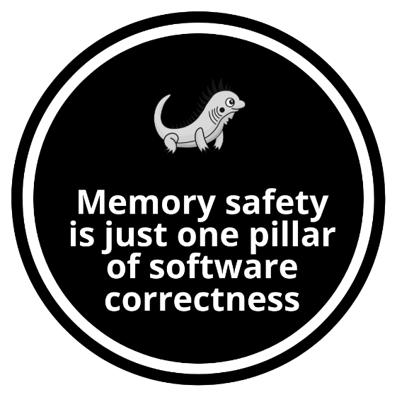

# Safety First

Hey there! Ready to dive into Zig, a systems programming language that's not only powerful but also surprisingly friendly?  This first chapter introduces some of the coolest things Zig has to offer.  It's like getting a first taste of what makes Zig the new kid on the block that everyone's talking about. 

We'll kick things off by exploring the current landscape of system programming and why a fresh language like Zig is exactly what developers need.  Common headaches faced with mainstream languages will be uncovered, followed by a look at how Zig tackles these issues head-on.  The basics of learning Zig will be covered, including its approach to syntax, memory management, and standout features like compile-time metaprogramming.  Additionally, Zig's philosophy of avoiding unnecessary complexity is highlighted, ensuring that what's seen in the code is exactly what's happening. 

Understanding these choices is super important because they'll help you write code that's efficient, reliable, and easy to maintain-whether you're building for embedded systems, operating systems, or cross-platform apps.  By the end of this chapter, you'll not only see why Zig is a strong alternative to other languages, but you'll also have your starter kit for thinking in Zig way.  You'll walk away with a solid understanding of how Zig's design makes it perfect for modern systems programming. 

In this chapter we're going to cover the following main topics: 

* Training your brain to think in Zig
* System programming reimagined
* Maintain with Zig
* A new era begins

## Training your brain to think in Zig

Learning a new programming language is no walk in the park, especially when it's a systems programming language like Zig. You might be tempted to blame your brain, thinking it just isn't wired to absorb all this low-level, technical stuff.  But the truth is, your brain isn't the problem-it's how you're feeding it. Your brain thrives on novelty.  It's always on the lookout for something new, something interesting.  That's how it's designed, to keep you alert and, quite literally, alive.  When faced with the routine, the ordinary, or the dull, your brain tunes it out, pushing it to the background so it can focus on what really matters. 

But how does your brain decide what's important? Imagine you're coding away, deep in thought, and suddenly your computer starts overheating, the fans roaring like a jet engine.  Your brain immediately kicks into high gear: neurons fire, emotions spike, and adrenaline pumps.  That's how your brain knows something crucial is happening.  It's all about survival, and yes, in coding, survival means keeping your machine-and your code-running smoothly. And trust me, by the end of this journey, you'll see that learning Zig isn't as hard as it might seem right now. 

Alright, let's get something straight. This isn't one of those "read and repeat" gigs where you zone out after the second paragraph. No, we're going to do something revolutionary: make you think. Shocking, I know.  We'll poke at that brain of yours with reflexive questions-because who doesn't love a little self-doubt in the middle of their learning process?  -and throw in quizzes that, if nothing else, will keep you awake. And then, just when you think you've got it, we'll slap you with some hands-on exercises to make sure you're not just nodding along like a bobblehead. 

Each chapter is a cleverly disguised trap-I mean, step-that builds on the last one. The complexity ramps up, but don't worry, it's all part of the master plan. You'll revisit those "core concepts" in new and exciting ways, because apparently, repetition is how the brain learns. Who knew? 

We'll kick things off with the basics. Yes, basics-because you've got to learn to crawl before you can faceplant trying to run. You'll get a taste of Zig's syntax and features, which will undoubtedly leave you wondering why you didn't pick up a more "mainstream" language.  But stick with it. You'll be solving problems, answering questions, and doing exercises that-believe it or not-are designed to be relevant to the real world. By the time we're done with you, Zig won't just be another language in your toolbelt- it'll be the chainsaw you reach for when you need to get serious work done. So, buckle up, buttercup. We're about to take you on a wild, sarcastic, and surprisingly effective journey through Zig programming! 

## System programming reimagined

When you venture into the tangled mess of system programming, it doesn't take long before you stumble upon the usual suspects. You've got the classics C and C++ those old rock bands that refuse to retire. Then there are the hipsters, D and Odin, who are so niche that just knowing they exist feels like an insider secret. And, of course, the cool kids swell in with Rust and Go, showing off their shiny features and acting like they've reinvented the wheel. But here's the kicker-despite all this variety, none of these heavyweights entirely manage to strike that elusive balance between simplicity, transparency, and portability. That is, until Zig crashes the party, making it clear that it's here to show everyone how it's really done. Zig doesn't just aim for the sweet spot; it plants its flag there and dares anyone to do better. 

### Language X vs. Language Y

Throughout this chapter, you'll notice some comparisons to other programming languages like C, Go, and Rust. Don't worry if you're not familiar with these languages- these comparisons are simply meant to resonate with those who are.  They help highlight where Zig stands out or takes a different approach. If any of these references don't ring a bell, that's perfectly fine. The goal is to give you a broader perspective, but you'll still get all the insights you need to understand Zig on its own terms.


### The genesis of Zig: fixing what's broken


Fed up with the endless landmines that C and C++ scatter across your path, [Andrew Kelly](https://andrewkelley.me) decided enough was enough. So, he set out on a mission to create Zig, a language that doesn't force you to choose between modern safety features and the low-level control that system programmers live for. Zig wasn't born out of some academic exercise or a desire to reinvent the wheel; it was forged out of sheer necessity, designed to fix the gaping holes left by its predecessors. In other words, it was born from his deep frustration with the shortcomings of C and C++, especially their undefined behavior, lack of safety guarantees, and the headaches of maintaining large codebases. As Kelly himself put it, "I have faith that we can do better." 

But with so many languages already vying for attention, why should Zig be the one to steal the spotlight? The answer lies in Zig's design philosophy: It's all about simplicity, transparency, and portability. So, before you dismiss it as just another contender, take a closer look. Zig isn't just another language to add to the pile; it's a complete toolchain for modern development, crafted to do what others only pretend to. He was also inspired by his experiences with other languages and tools, which led him to incorporate the features that we're exploring in this book.

But before diving deeper into Zig's virtues, let's take a step back and examine the competition. To truly appreciate what Zig brings to the table, it's worth understanding the flaws and limitations of the mainstream languages that have dominated the scene for so long. Zig is more than just a programming language, but to see why, let's first explore Zig purely as a programming language.

### The flaws of mainstream languages

Mainstream system programming languages, despite their widespread use, are riddled with flaws that have frustrated developers for decades. Let's break down a few of these pain points and see how Zig addresses them head-on:

#### **Garbage collection: a necessary evil?**
Garbage collection on paper sounds like a developer's dream. Automatic memory management that spares you the grunt work? Sign me up! But in reality, garbage collection is like that friend who shows up uninvited, makes a mess, and leaves you to clean up the chaos. The dreaded stop-the-world latency glitches are the price you pay for this convenience, and they can turn a smooth user experience into a stuttering nightmare. Sure, it's well-intentioned, but when your app grinds to a halt because of an untimely garbage collection pause, "well-intentioned" doesn't cut it.

#### **Automatic heap allocation: A ticking time bomb**
Then, there's automatic heap allocation. It's all fun and games until your system runs out of memory. At that point, your program isn't just inefficient, it's unusable. Crashes, hangs, and the dreaded out-of-memory errors are all too common when you let the system decide how and when to allocate heap memory. It's like handing the keys to your car to someone who doesn't know how to drive-things might go well for a while, but sooner or later, you're headed for a crash.

#### **Complex build processes: the ultimate headache**
Let's talk about build processes. If your language makes building from source a complicated mess of scripts, dependencies, and obscure tools, it's already lost the plot. A complex build process is an instant disqualification for most developers who just want to compile their code without needing a PhD in build systems. Yet, many mainstream languages seem to think convoluted build processes are a rite of passage.

### The Solution? Obviously Zig

Given these problems, it's clear that something new was needed. Enter Zig, the language that steps up where others fall short. Zig takes the flaws of languages and turns them into their strengths.

#### **No garbage collector, more control**
Zig skips the garbage collector entirely, sparing you from those unpredictable stop-the-world latency glitches. This design choice gives you full control over memory management, a critical feature for systems programming and performance-critical applications. With Zig, you decide when and how memory is allocated and deallocated, allowing for fine-tuned performance optimizations that are essential in environments where every byte and cycle counts.


#### **No hidden allocations**
In Zig, manual memory management isn't just an option. It's the norm. It takes a hands-off approach to memory allocation, giving you full control over when and how heap memory is used. There's no `new` keyword or language features that automatically allocate heap memory at runtime. Let me say it again: If you don't explicitly request a heap allocation, it won't happen. This starkly contrasts with languages like Go, where hidden allocations are common due to the automatic management of goroutines and garbage collection, leading to unpredictable performance in memory-constrained environments. Rust, while offering more control over memory allocation than Go, still includes a standard library that often assumes the presence of a heap. Zig, on the other hand, allows you to operate entirely without a heap, making it ideal for embedded systems or real-time applications where deterministic memory management is critical. Every standard library feature that requires heap memory is explicit, using an `Allocator` parameter. This ensures that memory management decisions are always in the hands of the developer, not hidden (or implicit) within the language. We'll explore this topic in Chapter 9, Memory Management.

So, we've seen how Zig expertly sidesteps the pitfalls that have plagued mainstream languages for years. But what really sets Zig apart is how it refines the best elements of C—its power and low-level control—for the modern developer. Let's dive into why Zig isn't just another option but the modern alternative to C that developers have been waiting for.

### A modern alternative to C

Zig is a strongly typed, compiled language that positions itself as a modern alternative to C. It offers the power and control of low-level programming with a clean, straightforward syntax. At its core, Zig maintains the familiar structure of C-like languages: statements are terminated with semicolons, and code blocks are defined by curly braces. This makes Zig instantly recognizable while introducing features that make it more versatile and safer for modern software development.

Don't worry! If the code looks unfamiliar, or some parts didn't quite click immediately. This is just a sneak peek. Every piece of this code will be broken down and explained in detail as we move forward in the book. By the time we're done, you'll not only understand every line but also be able to write your own Zig programs with confidence. For now, sit back and enjoy. Everything will make sense soon enough! 

Let's look at our first Zig snippet to see how this language blends the familiarity of C-like syntax with modern, developer-friendly enhancements.

```zig
const std = @import("std");

pub fn main() void {
    std.debug.print("Hello, World!\n",.{});
}
```

This code imports the standard library, defines a main function, and prints "Hello, World!" to the console. It's a straightforward way to see how Zig manages basic tasks like importing packages, defining functions, and outputting text while adhering to a clear and concise syntax.

You might already be wondering, "Is Zig just a better version of C?" Well, it's a fair question, and the quick answer is a resounding no; we'll see that Zig is much more than just an upgrade.

#### **Simplicity: Focus on what matters**
Languages like C++ and Rust are packed with features, but sometimes those features can become distractions. In Zig, simplicity is a core principle. There are no macros, no hidden language features, just straightforward, readable code. Zig is powerful enough to handle complex programs without requiring special cases or exceptions built into the compiler. This simplicity lets you focus on what really matters: developing your application. Languages with powerful macro systems and compile-time code generation, but can introduce complexity and subtle bugs if not used carefully. Go's simplicity is one of its strengths, but it comes at the cost of flexibility, particularly in areas like error handling and memory management. Speaking of which, we'll explore this topic with care in Chapter 8, Error Handling.


#### **No hidden control flow**
In Zig, what you see is what you get. If your code looks like it's executing a straightforward sequence of operations, then that's exactly what's happening. There are no surprises lurking in the shadows, no hidden function calls, no implicit control flow changes. As a brain teaser, take a look at the following code snippet and see if you can spot what might go wrong or which part of the behavior isn't immediately clear. But here's a warning: I encourage you to just ignore the urge to flip the page for the answer right away. Ready? Got your thinking cap on? 

```zig
var r = x + y.z;
funcA();
funcB();
```

Okay, here's the twist: there's actually nothing to discover! That's the beauty of Zig. In Zig, the code does exactly what it says. When you see `funcA()` followed by `funcB()`, that's precisely what happens-no sneaky hidden function calls, no unexpected surprises from operator overloading (Unlike C++'s), or property accessors. This predictability isn't just refreshing; it makes your code more readable and easier to reason about. Zig's got nothing to hide! Languages like Rust and Go introduce their own set of mechanisms. Rust with its macros and Go with goroutines, panics, and other forms of indirection. While powerful, these abstractions can sometimes obscure the underlying flow, making it harder to predict how code will execute, especially in complex systems. We'll dive deeper into this subject in Chapter 4, Control Flow and Loops.

#### **Compile-time execution**
One of the standout features of Zig is its powerful `comptime`, which is short for compile-time execution. This feature allows you to run code during the compilation process, enabling you to generate and manipulate code dynamically, enforce constraints, and optimize performance before your program even runs. It's like giving your compiler a crystal ball to predict and prepare for what's ahead. Thanks to `comptime`, Zig supports generics, enabling you to write flexible, reusable code while still maintaining strict type safety. But Zig doesn't stop there. It also boasts powerful compile-time metaprogramming capabilities, which let you perform complex computations, enforce constraints, and generate code during compilation. This not only enhances the language's expressiveness but also ensures that your programs are as efficient and optimized as possible, without the need for runtime overhead. If you're intrigued by this and want to dive deeper into the magic of `comptime`, don't worry, Chapter 12, Sophisticated Topics, will cover it in detail, along with other advanced features that make Zig truly unique.

#### **Tooling: ready to go, right out of the box**
Zig's tooling is designed to be as hassle-free as possible. With Zig, you get a single, statically compiled binary that includes everything you need; just download and start building. Whether you're targeting Linux, Windows, or macOS, Zig's tooling is ready to go right out of the box. And with features like GCC/Clang command-line compatibility, Zig integrates smoothly into existing workflows, making it an excellent choice for both new projects and existing codebases. This out-of-the-box readiness might remind you of another language with famously simple tooling, Go. Go's tooling is often praised for its simplicity and speed, and rightfully so. But while Go shines in its straightforward approach, Zig takes it a step further, especially when it comes to more complex build scenarios. Zig's integration of cross-compilation and direct C/C++ interoperability gives it a distinct edge, particularly when you're dealing with more intricate environments. Zig doesn't stop there. Its approach to testing is just as straightforward. You can write test cases directly within your code to ensure everything behaves as expected. And running these tests? It's as easy as typing `zig test`, a command that builds and executes your test cases using Zig's default test runner. Simple, powerful, and right in line with Zig's philosophy of no-nonsense development. For a comprehensive overview, see Chapter 6, Testing your Zig Code.


## More than just a language

While we took our first steps with Zig, it's easy to mistake it for just another programming language. But that's only scratching the surface. Zig is more than that- much more. It's not just a language; it's also a robust building system designed to streamline the entire process of building software. Whether you're compiling a simple project or managing a complex codebase, Zig's build system gives you powerful tools right out of the box.

### Why does Zig have its own build system?

Traditional build systems often come with a steep learning curve, requiring you to cobble together various tools and scripts to get your project up and running. With Zig, the build system is built into the language itself, offering a seamless experience that reduces friction and increases productivity. Zig's build system is designed to be cross-platform, easy to use, and tightly integrated with the language's features.

### A unified approach

Let's get one thing straight: Zig's build system isn't some half-baked afterthought or a bolt-on gimmick. No, it's woven right into the fabric of the language itself. This isn't about juggling multiple tools or switching gears mid-project. Everything you do, from writing your first line of code to hitting deploy, happens in Zig. And yes, that means the build system is written in Zig code too. So, no more mental gymnastics trying to remember which toolchain you're supposed to be using today.

Now, you might be thinking, "Sure, but what can it actually do?". Well, let's highlight the big hitters:

* **Cross-compile:** Ever wanted to target multiple platforms from a single codebase?  Zig's built-in cross-compilation has your back. Whether it's Linux, Windows, macOS, or some obscure platform only you and three other developers care about-Zig handles it.
* **Configure projects:** Forget about wrestling with bloated build scripts. In Zig, configuring your project is as simple as writing Zig code. Whether you're in debug mode, release mode, or the "please just work" mode, it's all done with straightforward, no-nonsense syntax.
* **Automate tasks:** Need to generate some code, run tests, or package your app?  Zig lets you script it all directly within the build system. That means no more hopping between tools or piecing together duct-taped workflows. Everything is streamlined, everything is Zig.

### Cross-compilation made easy

One of the great promises of programming is code reuse, but all too often, we end up reinventing the wheel due to compatibility issues or differing performance requirements. Zig addresses this by making it easy to write portable, reusable libraries. It's fully compatible with the C ABI, meaning you can seamlessly integrate Zig with existing C codebases or use Zig to build libraries that can be consumed by other languages.

Zig's build system also shines when it comes to cross-compilation. With the same `build.zig`, you can target different platforms without changing your code. Zig handles the details, making cross-compilation as straightforward as native compilation. Imagine a world where you're (practically) free of cmake, make, Powershell, and other build tools. Sounds good, right? With Zig, this world is a reality. In just a few lines of code, you can configure Zig to compile your project across all platforms. I don't mean to sound like a broken record, but it's worth repeating: there's no need to wrestle with a separate build language or decipher cryptic syntax.

In a world where build systems usually feel like an afterthought or, worse, a necessary evil, Zig's approach is refreshingly different. It's not just about getting your code to compile; it's about giving you complete control, all within a language that actually respects your time and sanity. It's not just about hitting multiple platforms with a single codebase; it's about maintaining that codebase with the same ease. And that brings us to Zig's motto: Maintain with Zig.

## Maintain with Zig

One of the Zig project's core principles is "Maintain with Zig." But what does that really mean? To put it into perspective, let's compare it to two other languages that embrace a progressive approach rather than pushing for massive, disruptive rewrites: Kotlin and Carbon.

### Kotlin & Carbon

Developed by JetBrains, Kotlin is a statically typed programming language that runs on the Java Virtual Machine (JVM) and can also be compiled to JavaScript or native code. Kotlin is designed to be fully interoperable with Java, which makes it a popular choice for Android development and enterprise applications.

Carbon is a language being developed by Google as a potential successor to C++. It aims to address C++'s limitations while maintaining performance and control over low-level system resources. Carbon is designed with modern language features to improve developer productivity and code safety.

Kotlin, for example, is a masterclass in interoperability. It seamlessly integrates with existing Java code, allowing developers to introduce it into established projects without turning everything upside down. Kotlin's design is all about making life easier, offering features like null safety, concise syntax, and coroutines for asynchronous programming while staying fully compatible with the sprawling Java ecosystem. What makes Kotlin so appealing is its gradual adoption path: developers can start small, converting one file at a time, and immediately reap the benefits without a steep learning curve.

Similarly, Carbon is Google's ambitious answer to the aging C++. Designed as a potential successor, Carbon doesn't demand that you throw out your entire C++ codebase. Instead, it's built to work hand-in-hand with C++, allowing developers to adopt Carbon incrementally, leveraging the existing C++ code and tools they've already invested in. Carbon respects the past while looking toward the future, offering a smooth transition for developers who are deeply entrenched in the C++ world.

Zig takes a similar path of progressive interoperability. It's not about rewriting everything from scratch, it's about evolving your projects with minimal disruption. Zig integrates seamlessly with C and C++ code, allowing you to maintain and enhance your existing systems while gradually introducing Zig's modern features. This strategy ensures that you can improve and maintain your codebase without the risks and costs associated with big rewrites. Just like Kotlin and Carbon, Zig respects the foundation you've already built while offering a better way forward.

With that in mind, let's explore how Zig's simple build system makes it effortless to maintain and enhance C and C++ codebases while seamlessly integrating modern features.

### Interoperability

One of the most challenging parts of maintaining C/C++ projects is dealing with the build system, a maze of configuration files and dependencies that pile up over time. Zig provides a solution to this headache with `zig build`, a tool designed to replace traditional build systems and streamline the entire process of building and maintaining your projects. Although we are exploring the build system in Chapter 11, Packing, let me give you the first glimpses of its characteristics.

One of the standout features of Zig's build system is its simplicity. You define your build process in a `build.zig` file, using Zig's language features to control every aspect of your build. This approach offers flexibility while keeping things simple and easy to understand. By creating a `build.zig` file, you can compile your project across all platforms without relying on external tools like Xcode, MSVC, or even basic build tools such as CMake, make, PowerShell, or autoconf. Sounds good, right? 

It does not just sound good, but it's already a reality. With a single `build.zig` file, you can compile your project across all platforms without relying on external tools like Xcode or even basic build essentials. Enough talk. The following snippet is a basic example of what a `build.zig` file looks like. _Don't bother to understand every aspect of it at first glance_.

```zig
const std = @import("std");

pub fn build(b: *std.Build) void {
    const exe = b.addExecutable(.{
        .name = "main",
        .root_source_file = b.path("main.zig"),
        .target = b.host,
    });
    b.installArtifact(exe);
}
```

In just a few lines of code, you've configured Zig to compile your project, set the build mode, and install the executable. You might notice that there's no need to learn a separate build language or struggle with cryptic syntax. Everything is clear and concise in Zig.

As you've probably noticed, the `std` package keeps popping up in our code snippets. That's no coincidence; Zig's standard library is a pivotal part of the language and plays a central role in development. It provides a rich set of tools and utilities that streamline everything from testing to handling common programming tasks. While we're touching on it briefly now, rest assured that we'll dive deep into the details of the standard library in Chapter 10, The Standard Library. There, you'll get a comprehensive understanding of how `std` empowers you to write Zig programs.

### Why not "simply" rewrite in Rust?


Rewriting critical or legacy software from scratch often leads to strategic pitfalls that can seriously impact a project's success. Imagine a scenario where a development team decides to start over instead of iterating on their existing codebase. This decision could lead to significant delays, giving competitors the opportunity to gain an edge while the team is tied up in redevelopment.

Discarding the old code isn't just about losing the code itself; it means potentially losing years of bug fixes, optimizations, and real-world adaptations that have made the software reliable. The belief that new code is inherently better is flawed. The existing code has already been tested and proven in various conditions, while starting from scratch risks reintroducing old problems and creating new ones.

A more effective strategy is to make incremental improvements-refactoring, optimizing, and reorganizing the existing code. This approach allows for the continuous evolution of the software while preserving its stability and reliability. Instead of taking on the risks and costs associated with a complete rewrite, incremental changes keep the software competitive and effective.

Moreover, the open-source community is incredibly diverse, making it unrealistic to expect universal adoption of a single language. To truly advance our critical software infrastructure, we should focus on improving the programming environment in systems development, rather than merely trading one set of issues for another. The idea of a fresh start might be appealing, but it often leads to wasted time, resources, and missed opportunities. The wiser approach is to build on what's already working, making deliberate, incremental changes that ensure the software remains robust and adaptable. This strategy is more prevalent in the Rust community. Oh! I almost forgot to mention: Rust doesn't build C. So rewriting is not a very progressive approach, right? RIGHT? 

Rather than abandoning the C/C++ ecosystem, Zig takes a different approach. It seeks to move forward in harmony with the legacy systems that have served us for decades. Zig is not just a language; it's a comprehensive toolchain that can compile C/C++ code, making it easier to maintain and evolve these projects without discarding everything that's been built. Zig bundles its own set of libcs to facilitate cross-compilation and provides commands like `zig cc` and `zig c++` to serve as in-place replacements for Clang. This integration allows developers to leverage Zig's modern features while still working within the established C/C++ ecosystem. The Zig project is even developing its own linker, ZLD, to eventually replace Ild, further reducing dependence on external tools like LLVM.

For a better understanding of how Zig excels at C interoperability, be sure to check out Chapter 12, Sophisticated Topics, where we'll explore this powerful feature in detail. There, you'll see how Zig makes working with C code not just possible, but downright easy.

### Too good to be ignored

The Zig build system unintentionally solves cgo issues by streamlining cross-compilation and dependency management. Unlike ago, which demands intricate configurations for each target platform, Zig handles cross-compilation seamlessly, with no need for external dependencies. This consistency eliminates platform-specific headaches, making it easier and more reliable to integrate C/C++ code into Go projects.

#### CGO

CGO is a feature in Go that allows Go programs to call C code directly. It integrates Go with existing C libraries, enabling access to low-level system features or performance-critical code. However, using CGO introduces complexities in cross-compilation and dependency management, often requiring additional setup and configuration to ensure compatibility across different platforms.

Building from source is a breeze in Zig, making it easy to integrate into development workflows. And when you combine this with Zig's various build modes, you have a toolset that's flexible enough to handle anything from quick debugging to production-ready releases. Zig offers several release modes that optimize your code for different scenarios:

* **Debug:** Perfect for development, this mode includes extensive safety checks and skips optimizations, making it easier to catch bugs and understand your code's behavior.
* **ReleaseSafe:** Strikes a balance between performance and reliability by optimizing your code while still retaining essential safety checks.
* **ReleaseFast:** In situations where speed is king, this mode removes most safety checks to achieve maximum performance.
* **ReleaseSmall:** Ideal for environments where space is limited, this mode focuses on producing the smallest possible binary size.

Each of these release modes allows you to adapt to your project's specific needs, ensuring that you're always using the right tool for the job. We'll delve deeper into each of these release modes in Chapter 11, Packing, where you'll learn how to make the most of Zig's build system.


Zig might not be running on 3 billion devices like some other languages that go well with coffee, but when it comes to truly "build once, run anywhere," Zig delivers on that promise without a caffeine boost.


### Language comparisons

As we progress through this chapter, you'll notice that the comparisons to other languages will start to fade into the background. That's intentional. While these early references help set the stage and highlight where Zig differs or excels, the real focus here is on mastering Zig itself. As we dive deeper, the spotlight will be solely on Zig, exploring its features, strengths, and the unique approach it brings to systems programming. This way, you'll fully immerse yourself in what makes Zig special without the distraction of constant comparisons.


## A new era begins

Systems programming has been stuck in the mud for too long, weighed down by the complexities of C/C++. But it doesn't have to stay that way. The Zig project brings a fresh perspective, making systems programming more accessible, practical, and efficient. With its powerful compiler, flexible build system, package manager on the horizon, and a very simple language, Zig is set to spark a revival in the craft of low-level programming. Luckily, you're getting ready to be part of this change. And just between you and me, now is the perfect time to dive into Zig. Whether you're contributing to open-source projects, learning the language, or just exploring what it can do, Zig offers the tools and community support you need to succeed. As we move forward, Zig is not just helping us maintain the past, it's building the future of systems programming.

### Safety

Safety is often touted as the ultimate buzzword in the latest wave of programming languages, and it's easy to see why. You've probably come across the phrase "Rust is a safer language" countless times online, and while there's truth to that, it's important to unpack what "safety" really means. But here's the thing: safety isn't just about avoiding memory leaks. It's a loaded term that gets thrown around like confetti. Rust is obsessed with memory safety, but that's only part of the picture. Zig, on the other hand, is more like the straight-talking uncle who doesn't care about being cool; it's fixated on getting the job done right. Zig's all about overall software correctness- making sure your code does what you think it does, no smoke and mirrors. It's almost like Zig was designed to keep you from outsmarting yourself, avoiding those "clever" mistakes that make you want to slam your head into the keyboard. So yeah, safety is great and all, but Zig is playing a different game. It's not just about keeping you safe from memory bugs; it's about making sure your code is as straightforward and reliable as possible. No tricks, no surprises, just solid, predictable behavior.

In case of doubt, create a sign and keep it near you with the words 'Memory safety is one pillar of software correctness' on it.



Alright, let's talk about Zig and why it's like the safety helmet C wishes it had. You see, in C, you can create a struct and just forget to initialize half the fields. No big deal, right? Just a ticking time bomb waiting to blow up your code. But in Zig? Nah, Zig doesn't play that game. Every field gets initialized, or the compiler smacks you upside the head. No mystery bugs creeping in because you forgot something. It's like having your own personal safety inspector, except this one doesn't miss a thing.

Also, Zig doesn't just suggest you handle errors or missing data; it practically forces you to. No more rolling the dice with undefined behavior like you do in C. Zig catches that nonsense early and keeps you out of the ditch. Oh, and then there's `comptime`. Think of it as Zig's way of saying, "Hey, how about we catch some bugs before you even hit 'run'?". You get to validate and generate code at compile time, so by the time your program runs, it's already been through the ringer. Meanwhile, C just sits there, letting you trip over runtime errors like it's 1990.

Memory layout? Zig's got you covered there, too. With field reordering and packing, you can make your structs lean and mean without getting smacked by misaligned memory issues. And let's not forget Zig's pièce de résistance: non-null pointers by default. In C, you get pointers that can be null because, hey, who doesn't love a good segmentation fault?  But Zig? Zig doesn't do null unless you specifically ask for it. It's like Zig saying, "You want null? Fine, but it's on you, buddy."  The result? Fewer crashes, more stability. Zig also gives you safe indexing with `array[idx]`. It's a little thing, but in C, it's terrifyingly easy to go out of bounds and start corrupting memory like it's your day job. Zig says, "Not on my watch," and keeps your indexing in check, so your code doesn't go rogue. The summary is, Zig solves this by simply removing a lot of the footguns from pointers and adding additional guard rails.

At first glance, Zig might come across as an idealistic project-promising simplicity, safety, and a robust build system in a way that almost sounds too good to be true. But here's the thing: Zig is anything but a pipe dream. It's grounded in reality, with every feature and claim not just theoretical, but operational right now. This isn't some lofty vision for the future; it's a practical, material solution that's already up and running, ready to be put to work in real-world projects. Zig's strength lies in its ability to deliver on its promises today, making it a language that's as reliable as it is innovative.

If you're eager to explore how these tools are applied in real-world scenarios, head over to Chapter 13- Real-World Projects Built with Zig. There, you'll find examples that demonstrate how Zig can be used to tackle real development challenges, helping you connect the dots between theory and practice.

### Where to use Zig?

Zig is a versatile language designed for systems programming, with several common use cases and domains where it excels:

* **Embedded systems:** Zig's low-level control and ability to manage memory directly make it ideal for embedded systems development. It allows developers to write highly efficient code for resource-constrained environments.
* **Operating systems:** Zig's deterministic behavior and precise control over hardware make it suitable for writing operating systems, drivers, and other critical system-level software.
* **Cross-Platform development:** Zig's powerful cross-compilation capabilities simplify building software that runs on multiple platforms, making it a strong choice for cross-platform applications and tools.
* **Game development:** With its focus on performance and efficiency, Zig is well-suited for game development, particularly in areas requiring fine-tuned control over memory and CPU usage.
* **Networking and systems tools:** Zig's safety features combined with its performance optimizations make it a good fit for building networking tools, servers, and other high-performance systems utilities.
* **Interfacing with C/C++:** Zig can seamlessly interact with C and C++ codebases, making it useful for extending or optimizing existing projects in these languages.

Hold your horses! If you're as excited about Zig's features as I am, I get it. The hype is real, but it's not quite ready for prime time in production just yet. So, you can expect regular refactors and breaking changes. These changes are a natural part of its development process as the language matures and improves. Until Zig reaches its 1.0 release, adaptability and flexibility will be essential as we navigate these updates together. In Chapter 14, Zig's Future and Community, we'll explore how to keep up with the changes and engage with the Zig community.

**You're about to complete the first step towards learning Zig**. Don't stress over the initial bumps in the road; every journey has its own twists and turns, and each skill level comes with its own unique challenges. Embrace the process and remember that success looks different for everyone. The important thing is that you're making progress, and that's what really counts!  So, strap in and embrace the thrill of the unknown-because with Zig, you're not just learning a language; you're part of a pioneering community, pushing the boundaries of what's possible in software development.

## Summary

As we wrap up this introductory chapter, you've now got a glimpse of what Zig brings to the table. You got the lowdown on why Zig is the go-to choice for anyone tired of the quirks and headaches of C and C++. We talked about how Zig keeps things simple and safe, without making you pull your hair out over memory bugs. You'll find that what you learned here is the foundation for beginning to master Zig and trust me, it's going to make your life a lot easier.

Next up, we're going to roll up our sleeves and get [your Zig development environment](SETUP_YOUR_ENV.md) up and running and ensure you're fully equipped to write, test, and build with Zig. This is where things get real, as we take all the theory we covered today and take the first step to produce actual code. Ready to keep the momentum going? Let's do this! 

