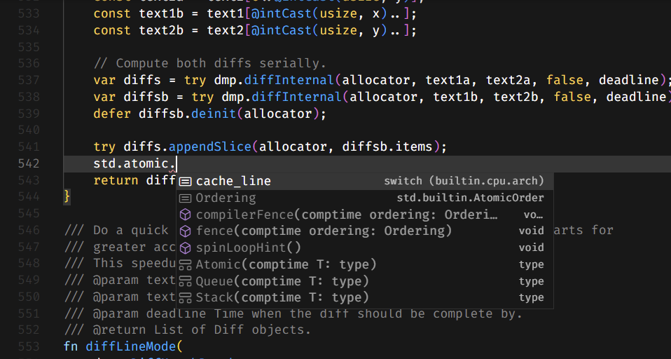

## Setting Up Your Playground

Ah, so you've decided to keep going with Zig. Brave of you. I'm genuinely impressed - most people would've bailed by now, but not you. Good choice - assuming you enjoy having control over every little detail without the usual headache that comes with most systems programming languages. But before we dive into the code and start flexing those low-level muscles, we need to address something crucial. If you think you can embark on this journey without setting up a Language Server Protocol (LSP), you might as well grab a club and start drawing on cave walls. Seriously, in the world of modern programming, not having an LSP running is practically prehistoric. But don't worry, we'll get you sorted. This chapter is all about getting Zig installed and ensuring your setup isn't stuck in the Stone Age.


By the end of this chapter, you won't just have Zig installed; you'll be ready to dive headfirst into Zig with all the confidence of someone who knows exactly what they're doing - or at least someone who's really good at pretending they do. So let's leave the caveman days behind and step into the future of systems programming, shall we?

In this chapter we're going to cover the following topics:

* Installing Zig
* Configuring ZLS

## Installing Zig

So, you've decided to give Zig a whirl. Smart move. Now, if you're anything like me, you've probably spent more time than you'd like wrestling with installers who act more like gatekeepers than helpers. But fear not - Zig isn't here to make you question your life choices. In fact, installing Zig is so refreshingly straightforward that you might wonder if there's a catch. Spoiler: there isn't. No bloated installers, no mysterious errors, and no convoluted dependency chains. Just you, a few commands, and the promise of a programming language that's as sharp as a tack. Why sharp? Because Zig gives you the kind of low-level control that makes other languages look like they're wrapped in bubble wrap. Whether you're on Linux, Windows, or macOS, the process is quick, painless, and - dare I say it - pleasant. So, let's cut through the nonsense and get Zig up and running. After all, you've got better things to do, like programming with the kind of confidence that only comes from true control.

### Playing it safe or living on the edge: Your first Zig dilemma

I have a question for you: do you go with the stable, tagged release or take a walk on the wild side with the nightly build? Let's be real - Zig hasn't hit v1.0 yet, and its release cycle is tied to LLVM's rather leisurely six-month pace. That means official Zig releases can feel like they're arriving by snail mail, and by the time they do, they might be a bit stale compared to the cutting-edge changes happening daily. Sure, you can dip your toes in the Zig pool with a tagged release, and that's fine if you're just testing the waters. But if you decide that Zig is your new best friend and want to really dig in, do yourself a favor and switch to a nightly build. Why? Because that's where the real action is, and it'll save you a lot of head-scratching when you try to follow tutorials or ask for help. The Zig community and resources like [zig.guide](https://zig.guide/) keep up with the master branch, not the fossilized versions.

Confused? Let's play a quick game called: Stable or Bold.

### Stable or Bold

**Question:** Is your project already in production or soon to be?

- **Yes:** Stable Release is recommended. You want the reliability and support of a thoroughly tested version.
- **No:** Move to the next question.

**Question:** Are you comfortable with potential bugs or breaking changes?
- **Yes:** Nightly Build is recommended. You'll get access to the latest features and updates.
- **No:** Move to the next question.

**Question:** Do you rely on tutorials, community resources, or third-party libraries? 
- **Yes:** Nightly Build is recommended. Most resources and active community discussions are aligned with the latest master branch.
- **No:** Move to the next question.

**Question:** Is compatibility with external tools or systems critical for your work? 
- **Yes:** Stable Release is recommended. This version ensures better compatibility and integration with other tools.
- **No:** Move to the next question.

**Question:** Are you okay with frequently updating your environment? 
- **Yes:** Nightly Build is recommended. It keeps you up to date with the latest changes, though it may require more frequent updates.
- **No:** Move to the next question.

**Question:** Do you prefer a "set it and forget it" approach to your development environment? 
- **Yes:** Stable Release is recommended. This version offers a more hands-off experience, with less frequent updates.
- **No:** Consider your other priorities.

**Question:** Are you experimenting with new features or testing edge cases? 
- **Yes:** Nightly Build is recommended. It's ideal for experimentation with the latest enhancements and fixes.
- **No:** Move to the next question.

**Question:** Are you looking to contribute to Zig or stay closely aligned with the language's development? 
- **Yes:** Nightly Build is recommended. Contributing to Zig is best done on the cutting edge.
- **No:** Stable Release is recommended. It's more suitable for non-experimental, stable use.

**Final Decision:** 

If you've mostly answered "Yes" to stability, compatibility, and less frequent updates → **Choose the Stable Release**.

If you've mostly answered "Yes" to wanting the latest features, being comfortable with frequent updates, and staying aligned with the master branch → **Choose the Nightly Build**.

The silver lining? Zig makes it ridiculously easy to switch between versions or even run multiple versions side by side. Each release is a self-contained bundle that you can plop anywhere on your system. There is no mess, no fuss, just pure flexibility. Let's explore how to make it happen with the three main OSs: Linux, Windows, and macOS.

### Linux: The land of choices 

If you're running Linux, you're probably no stranger to making choices (and sometimes, too many). For the sake of convenience, let's start with the easy option: your distribution's package manager. Most major Linux distros package the latest release of Zig, so why not give your fingertips a rest and install it the easy way?  And if you're curious about all the package managers with Zig available, you can find the complete list at this [link] (https://github.com/ziqlang/zig/wiki/Install-Zig-from-a-Package-Manager).

But let's say you're the type who enjoys a bit more control, perhaps even a tinge of masochism. In that case, you can install Zig manually.

First, you'll need to download a prebuilt version of Zig. The binaries are conveniently located on the Zig download page (https://ziqlang.org/download/#release-master). The "master" in the URL refers to the master branch, which contains the latest nightly builds. However, if you're looking for a specific version of Zig, such as 0.14.0, you can easily switch to that by using a URL like this one - https://ziglang.org/download/#release-0.14.0.

Before you download, make sure you grab the right build for your CPU architecture. If you're not sure whether your machine is x86_64, arm64, or something else equally mysterious, you can find out by running: 

```bash
uname -m
```

Once you know your architecture, you can use `wget` to download the Zig binary directly to your machine. For example, if you're grabbing the master branch build for x86_64, you would run: 

```bash
wget [https://ziglang.org/download/0.13.0/zig-linux-x86_64-0.14.0.tar.xz](https://www.google.com/search?q=https://ziglang.org/download/0.14.0/zig-linux-x86_64-0.13.0.tar.xz)
```

After the download completes, extract the archive with:

```bash
tar xf zig-linux-x86_64-0.13.0.tar.xz
```

Now, unless you want to be typing out the full path to your Zig binary every time (and trust me, you don't), you'll need to add Zig to your PATH:

```bash
echo 'export PATH="$HOME/zig-linux-x86_64-0.14.0:$PATH"' >> ~/.bashrc
```

And there you have it! Zig on Linux is served just the way you like it.

> [!NOTE] 
> This command works perfectly if you're using Bash, which is the default shell for many Linux distributions. However, if you're using a different shell, such as Zsh, Fish, or something more exotic, you'll need to tweak that command slightly.

### Windows: The land of path variables and PowerShell 

Windows users, rejoice! You have options too. Zig can be installed via one of the many package managers available for Windows: Chocolatey, Scoop, or Winget. Each of these comes with its own quirks, but any will get the job done: 

```powershell
choco install zig
```

Or:

```powershell
winget install zig.zig
```

Or:

```powershell
scoop install zig
```

But if you're the type who likes to take the road less traveled (or just enjoy unnecessary complexity), you can manually download Zig. Once again, be sure to choose the right build for your CPU architecture. Most Windows systems will be x86_64, which Microsoft, in their infinite wisdom, also calls AMD64. To check, just run: 

```powershell
$Env:PROCESSOR_ARCHITECTURE
```

After downloading, extract the files to a directory of your choice. Now comes the fun part: adding Zig to your PATH. For a system-wide installation, use: 

```powershell
[Environment]::SetEnvironmentVariable(
    "Path",
    [Environment]::GetEnvironmentVariable("Path", "Machine") + ";C:\path\to\zig-windows-x86_64-0.13.0", # Replace with actual path
    "Machine"
)
```

Or, if you'd rather keep things local to your user: 

```powershell
[Environment]::SetEnvironmentVariable(
    "Path",
    [Environment]::GetEnvironmentVariable("Path", "User") + ";C:\path\to\zig-windows-x86_64-0.13.0", # Replace with actual path
    "User"
) 
```

Remember to replace `C:\path\to\zig-windows-x86_64-0.14.0` with the actual path where you extracted Zig. And yes, you need to do this step; otherwise, you'll be cursing your machine (with the full path to zig binary) every time you try to compile something.

### Mac: The cult of brew 

Ah, macOS, where everything just works... until it doesn't. Luckily, getting Zig here is straightforward if you're part of the Homebrew cult. Just run: 

```bash
brew install zig
```

And just like that, Zig is installed. Easy, right? 

### Verifying your install 

Now that you've gone through the motions, it's time to verify that Zig is ready to serve. Run: 

```bash
zig version
```

If everything goes well, you should see something like: 

```
0.14.0
```

### BTW I use ~~Arch~~Nix

If you're already rocking Nix, you're probably no stranger to doing things in style. Nix has been gaining more and more adopters over the years, turning what was once a niche, hipster approach into something a bit more mainstream, though it still carries that cool, "I was into this before it was popular" vibe.

With Nix already installed on your system, installing Zig is as simple as: 

```bash
nix-env -iA nixpkgs.zig
```

This will pull the latest stable version of Zig directly from the Nix package repository. No fuss, no muss - just pure, unadulterated convenience. And if you're in the mood for something a little more cutting-edge, you can easily customize your setup to grab a specific version or even a nightly build by tweaking your Nix expressions.

The beauty of using Nix lies in its ability to manage multiple versions of Zig (or any software) without cluttering up your system. Each version is neatly contained, ensuring that your environment stays clean and your workflow remains smooth. Nix might have started as the package manager of choice for the hipster crowd, but with its growing adoption, it's becoming the go-to tool for developers who value reproducibility and isolation in their software environments. So while it may not be as underground as it once was, using Nix still shows you're ahead of the curve - and who doesn't want that? 

But why stop there? If you're the kind of developer who likes to squeeze every drop of efficiency out of your tools, there's one more step to take: setting up the Zig Language Server (ZLS) for your favorite text editor.

## ZLS for smarter Zig coding 

One of the best things about Zig is how easy it makes building things from scratch. This isn't just a perk for your own projects - it's baked right into the tools that make up the Zig ecosystem. In this section, we're going to show you just how painless it is to build and set up your development environment, using the Zig Language Server (ZLS) as our prime example. Whether you're a Zig newbie or a seasoned pro, you'll quickly see how Zig's "keep it simple" philosophy applies across the board. By the end of this little adventure, you'll have ZLS up and running in your editor of choice, and you might just find yourself admiring the elegance of Zig's build system.

### Building ZLS from source 

Ready to roll up your sleeves? Let's dive into building ZLS from the source. It's a great way to see just how smooth and satisfying working with Zig can be.

First things first, you need to get your hands on the ZLS source code. Fire up your terminal and clone the ZLS repository to your local machine. This will give you access to the freshest, most cutting-edge code.

```bash
git clone [https://github.com/zigtools/zls.git](https://github.com/zigtools/zls.git) 
cd zls 
```

Now that you've got the source code, it's time to build ZLS. And guess what? Zig makes this part ridiculously easy. Just run the following command, and let Zig's build system do its magic: 

```bash
zig build -Doptimize=ReleaseSafe
```

If you choose the path of a stable release, the ZLs should match the Zig version installed. If you have, for example, Zig 0.14.0, you should go with the ZLS 0.14.0. The easiest way to do it is to `git checkout` the proper tag before building:

```bash
git checkout 0.14.0 && zig build -Doptimize=ReleaseSafe
```

Whatever the path you choose, the command compiles ZLS in release mode and is optimized for safety and efficiency. Before you know it, you'll have a shiny new ZLS binary ready to go. With ZLS built and ready, it's time to integrate it into your coding workflow.

> [!WARNING]
> Don't forget to put the ZLS binary in your `PATH` to make it accessible without using the full path.

### Integrating ZLS 

Good news! No matter what code editor you prefer, chances are it's fully equipped to handle Zig syntax highlighting and has solid support for integrating with the ZLS. From the sleek interfaces of modern IDEs to the minimalist charm of terminal-based editors, you've got plenty of options. While there are tons of editors ready to make your Zig coding experience smooth and efficient, we're going to focus on two popular choices that cater to distinctly different types of developers: VSCode and Neovim. 

VSCode is a go-to for those who prefer a somewhat polished, feature-rich environment, packed with extensions and an arguably intuitive GUI. On the other hand, 

Neovim is favored by developers who appreciate a lean, highly customizable, and keyboard-centric workflow. 

If you're using a different editor, don't worry! Many other editors also support Zig and ZLS, and you can find detailed instructions in the official Zig documentation. So, no matter what your preference, you're covered. 

Let's dive into how you can set up VSCode and Neovim for the ultimate Zig development experience.

#### Using ZLS in VSCode 

Getting ZLS up and running in VSCode is about as straightforward as it gets. All you need to do is install the [official Zig Language extension](https://marketplace.visualstudio.com/items?itemName=ziglang.vscode-zig), and you're good to go. This extension provides full support for ZLS, giving you all the benefits of intelligent code completions, go-to-definition, and more.


*Figure 2.1 - VSCode with the LSP information available.*

Here's how to set it up:

1.  Open VSCode (or VSCodium, if you prefer the open-source variant).
2.  Search for `Zig Language` in the Extensions marketplace.
3.  Install the extension with a single click.
4.  Restart VSCode, and you're all set.

Once installed, the extension takes care of everything else, integrating seamlessly with ZLS. Whether you're writing code, debugging, or navigating your project, you'll find the experience smooth and efficient. No fuss, no headaches, just pure Zig coding bliss.

#### Using ZLS in Neovim 

If you're a Neovim user, chances are you appreciate the finer things in life - like minimalism, efficiency, and the joy of configuring your editor exactly the way you want it. Setting up ZLS in Neovim takes a bit more effort than in VSCode, but the payoff is a highly customized and streamlined Zig development environment.


> [!WARNING]
> **Mason**: if you're using the Zig master branch, **do not install ZLS via the Mason package manager**. Mason only installs the latest tagged release of ZLS, which might not be compatible with Zig master. Instead, follow the manual installation steps below to ensure everything works seamlessly.

For this setup, we'll use the `nvim-lspconfig` plugin along with some specific configurations for ZLS. This guide assumes you're already familiar with setting up other features like keybindings and autocompletion. If not, refer to the `nvim-lspconfig` [documentation](https://github.com/neovim/nvim-lspconfig) for more details.

Here's how to get ZLS up and running: 

1.  **Install the `vim-plug` plugin manager:**
    If you haven't already, you must set up `vim-plug` to manage your Neovim plugins.

2.  **Configure Your `init.lua` with `vim-plug`:** 

```lua
local vim = vim
local Plug = vim.fn['plug#'] 

vim.call('plug#begin') 

Plug('neovim/nvim-lspconfig')  -- Neovim LSP configuration plugin 
Plug('ziglang/zig.vim')  -- Zig language support plugin 

vim.call('plug#end') 

vim.g.zig_fmt_parse_errors = 0 -- Disables display of parse errors in separate window 
vim.g.zig_fmt_autosave = 0 -- Disables format-on-save from zig.vim 

-- Enables format-on-save using nvim-lspconfig and ZLS 
vim.cmd [[autocmd BufWritePre *.zig lua vim.lsp.buf.format()]] 

local lspconfig = require('lspconfig') 

lspconfig.zls.setup { 
    -- cmd sets path to ZLS executable (omit if in PATH)
    cmd = {'/path/to/zls_executable'},
    settings = { 
        zls = { 
            -- sets path to Zig executable (omit if in PATH)
            zig_exe_path = '/path/to/zig_executable',
        }
    }
}
```

**Configuration Options:** 
You can set configuration options for ZLS in two ways: 
1.  By editing your `zls.json` (applies globally to editors using ZLS).
2.  By setting in-editor configuration options with the `settings` field within the `setup` function (Neovim specific).

By default, `zig.vim` might have format-on-save enabled. This setup disables it in favor of using ZLS to handle formatting, ensuring consistency with the Zig community's best practices.

**Zig Path** 
> Make sure to specify the paths to both `zls` and `zig` if they aren't already in your system's PATH. This ensures that Neovim/Vim can correctly find and use these tools.

**Why `zig.vim` specifically?** 
And here's a little bragging point: the Zig Vim plugin you're using gets contributions from no other than Andrew Kelley, the creator of Zig. While he doesn't maintain it full-time, his occasional contributions ensure that `zig.vim` stays aligned with the language's evolving features. When the person who designed the language collaborates on the plugin, you can trust that it's a solid choice for your Zig development setup. So, when you're coding in Neovim, you're not just using any plugin, you're using one that's been touched by the hands that built Zig.

### Fine-tuning ZLS 

Now that you've got Neovim (or your preferred editor) configured to work with ZLS, it's time to take things a step further and fine-tune your setup with a `zls.json` configuration file. This file allows you to customize ZLS behavior across all editors that use it, giving you control over everything from which Zig executable to use, to how semantic tokens are handled.

Here's a simple example of what your `zls.json` might look like: 

```json
{
    "zig_exe_path": "/path/to/zig_executable",
    "semantic_tokens": "partial",
    "enable_build_on_save": true
}
```

This file must be valid JSON, so remember - no comments, no trailing commas, and no funny business.

#### Finding the right spot for your `zls.json` 

If you're wondering where to put this configuration file, ZLS has you covered. Since version 0.14.0, you can easily find out where ZLS will look for your `zls.json` by running: 

```bash
zls env
```

This command will give you a detailed output showing where ZLS searches for the configuration file. Typically, ZLS first checks the local `config_dir` (usually something like `/home/youruser/.config`) and then falls back to the global config dir (often `/etc/xdg`). Once you've placed your `zls.json` in the appropriate location, you can verify it by running `zls env` again, and you should see something like this: 

```json
{
    "version": "0.14.0-dev.50+3354fdcb",
    "global_cache_dir": "/home/user/.cache/zls",
    "global_config_dir": "/etc/xdg",
    "local_config_dir": "/home/user/.config",
    "config_file": "/home/user/.config/zls.json",
    "log_file": "/home/user/.cache/zls/zls.log"
}
```

For versions of ZLS before `0.14.0-dev.50+3354fdcb` (Yes! That specific!), you can locate the configuration path by running: 

```bash
zls --show-config-path
```

This will either show the path to an existing `zls.json` or point you to the local configuration folder where you can create one.

The `zls.json` file is where you can really tailor ZLS to fit your workflow. Want ZLS to automatically run `zig build` every time you save? You got it. Prefer partial semantic tokens to keep things lightweight? No problem. You can explore all available configuration options by checking out the `Config.zig` file in the ZLS source or by using the JSON Schema. With your editor and ZLS finely tuned, you're now equipped to tackle Zig projects with a setup that's not just functional but tailored perfectly to your needs.

### Taking ZLS to the next level 

So you've got ZLS set up and humming along nicely, catching your errors as you code. But what if I told you it could get even better? That's right, by following [this official ZLS guide](https://zigtools.org/zls/guides/build-on-save/), we're about to supercharge your setup by adding a custom build step that will make sure no error slips through the cracks.


## Zig setup - surprise test! 

Before we wrap up this chapter, let's take a moment to test what you've learned so far. Whether you're feeling confident or just want to see where you stand, this short quiz is designed to reinforce the key concepts we've covered. It's a fun way to make sure you're ready to tackle your Zig projects with all the tools and knowledge you need. Ready? Let's dive in and see how much you've mastered! 

**Question 1:** You've decided to install Zig on your system. What is the first thing you should consider? 

* A) Downloading the Zig Language Server (ZLS)
* B) Choosing between the stable release and the nightly build
* C) Setting up your text editor

**Correct Answer: B** - Choosing between the stable release and the nightly build is crucial as it will determine the version of Zig you'll be working with.

**Question 2:** You're on a Linux system and want to install Zig. What is the quickest way to get Zig up and running? 

* A) Build Zig from source 
* B) Use your distribution's package manager 
* C) Download a prebuilt binary from the Zig website 

**Correct Answer: B** - Using your distribution's package manager is the easiest and fastest way to install Zig on Linux.

**Question 3:** True or False: The stable release of Zig is recommended if you want access to the latest features and improvements.

* A) True 
* B) False 

**Correct Answer: B** - False. The nightly build is where you'll find the latest features and improvements, while the stable release is more focused on stability.

**Question 4:** You've downloaded Zig for Windows manually. What must you do to make sure you can easily run the `zig` command from anywhere in the command prompt? 

* A) Copy the `zig.exe` file to the System32 folder 
* B) Add the path to Zig's binary to your system's PATH environment variable 
* C) Install Zig using Chocolatey instead 

**Correct Answer: B** - Adding Zig to your PATH environment variable ensures that you can run the `zig` command from any directory.

**Question 5:** When setting up the Zig Language Server (ZLS), why is it important to make sure it's compatible with the version of Zig you're using? 

* A) ZLS only works with stable releases 
* B) ZLS might not support the latest features or syntax of the nightly build if mismatched 
* C) ZLS requires a specific Zig configuration file to run 

**Correct Answer: B** - Ensuring compatibility between ZLS and the version of Zig you're using is important because ZLS might not support all features or syntax in mismatched versions.

**Bonus Question:** You've chosen the nightly build because you want the latest features. What should you keep in mind as you start coding? 

* A) You might encounter bugs or breaking changes that aren't present in the stable release 
* B) Tutorials and community resources might be outdated compared to your version 
* C) Both of the above 

**Correct Answer: C** - Both of the above. Using the nightly build gives you access to the latest features but comes with potential risks and challenges.

**Results:** 

* **5-6 Correct Answers:** Zig Master! You're ready to take on the world with your fully equipped Zig setup. Time to code like a pro! 
* **3-4 Correct Answers:** Zig Apprentice! You've got a solid understanding, but there's still room to refine your setup skills.
* **0-2 Correct Answers:** Zig Novice! Don't worry, every journey starts with a first step. Go back and review, and you'll be a Zig master in no time! 

## Summary

So, you've survived the initiation rites of installing Zig on your machine - congratulations. Whether you're on Linux, Windows, or macOS, you've seen firsthand that Zig doesn't believe in making things harder than they need to be. No convoluted installer rituals, just a few commands, and boom - you're up and running. And let's not forget the existential question you faced: do you play it safe with the stable release or flirt with danger using the nightly build?  We've covered that, reminding you that Zig makes it ridiculously easy to flip between versions whenever the mood strikes.

But wait, there's more! We didn't just stop at getting Zig installed. No, we went full throttle into setting up the Zig Language Server (ZLS), guiding you through building it from source and integrating it into your editor of choice - whether you're a fan of VSCode's polished interface or Neovim's minimalist charm. And because we don't believe in half measures, we also walked you through configuring ZLS to run builds on save, ensuring you catch errors before they become your next big headache.

These steps weren't just busywork; they're the foundation of a streamlined, frustration-free Zig development environment. And trust me, having a setup that just works is worth its weight in gold when you're knee-deep in code.

But here's the kicker - we're barely getting warmed up. In the next chapter, we're not just going to talk about the Zig toolchain; we're going to put it to work. You'll write your very first Zig program and explore the toolchain's powerful features, discovering firsthand how they can turn a simple piece of code into a working program. It's the natural progression from setting up your environment to actually building something that works - and works well. Turn the page and let's get started on something truly exciting.
